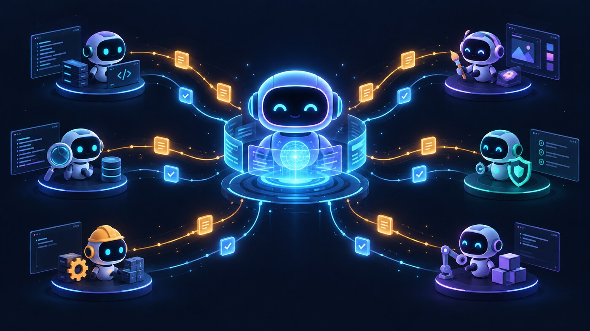

# Delegation Layer

<p align="center">
  <a href="#install"></a>
</p>

Give your lead AI agent a reliable way to delegate bounded coding work to the
provider that fits the task.

Delegation Layer is a local CLI and Agent Skill for supervising one finite turn
of a coding agent, checking its capabilities at runtime, and returning a
validated result with durable evidence. It works with the provider CLIs you
already use instead of replacing them.

## Why use it?

- **One simple control layer** — your agent can discover providers and dispatch
  work through one provider-neutral interface.
- **Bounded by design** — every task has an explicit workspace, permission mode,
  and time budget.
- **Recoverable results** — a later `collect` call can read a finished task
  without launching the provider again.
- **Resumable turns** — a durable timeout can continue the exact provider
  session through a linked successor task.
- **Runtime compatibility** — the selected provider's executable and advertised
  capabilities are checked when the task is prepared.
- **Native authentication** — provider login stays with the provider CLI; task
  state does not contain copied credentials.

## How it works

1. Install the Agent Skill so your harness knows how to use Delegation Layer.
2. The lead agent discovers the available provider capabilities.
3. Delegation Layer admits one bounded provider turn through the supervisor.
4. The lead agent collects the sealed result and evidence.

## Install

### Install the Agent Skill

The standard Agent Skills installer works across popular coding agents. From
the project where you want the skill available, run:

```sh
npx --yes skills add hishamkaram/delegation-layer --skill agent-integration
```

The `--skill agent-integration` selection matters because this repository also
contains maintainer skills. The installer detects supported agents and lets you
choose the project or global scope. Add `--global` to install for all projects,
or `--agent codex` (and similar agent names) to choose a specific harness.

If you want the Delegation Layer guided installer instead, run:

```sh
npx --yes delegation-layer install
```

It provides an interactive scope and harness picker, with global installation
selected by default. For scripts or a choice without prompts:

```sh
npx --yes delegation-layer install \
  --scope project \
  --harness universal \
  --yes
```

The skill installer only installs guidance for your agent. It does not install
the CLI, change provider logins, or run a task.

### Install the CLI

Use the prebuilt installer that fits your machine:

```sh
curl -fsSL https://raw.githubusercontent.com/hishamkaram/delegation-layer/main/install.sh | sh
```

```sh
brew install hishamkaram/tap/delegation-layer
```

```sh
npx --yes delegation-layer install-cli
pnpm dlx delegation-layer install-cli
bunx --bun delegation-layer install-cli
```

The release installer verifies checksums and installs `delegate`,
`delegate-run`, `pueue`, and `pueued` into `$HOME/.local/bin` by default. The
CLI uses the bundled supervisor automatically. Set
`DELEGATION_LAYER_INSTALL_DIR` to use another directory.

Check the installation:

```sh
delegate --help
delegate providers --json
```

## What you need to run a task

Normal users do not need Go or Node after choosing an installation method.
Dispatching a task requires:

- a released Delegation Layer CLI;
- a compatible provider CLI with an available native login;
- a supported provider CLI such as `agy`, `codex`, `claude`, `pi`, or `opencode`;
- Darwin or Linux on amd64 or arm64 for the supplied release builds.

The release contains the supervisor client and daemon and starts a private
instance under the state root, recovering it when a control command finds it
stopped. An explicit `--pueue-config` or
`DELEGATE_PUEUE_CONFIG` can still select an existing compatible supervisor for
advanced integrations. Node.js 18 or newer is needed only for the npm-based
installers; it is not a runtime requirement for the released Go CLI. Provider
authentication remains native to each provider. Your provider settings, MCP
servers, plugins, and skills stay with that provider. Permission modes select
native behavior; Delegation Layer is not an independent sandbox. Authorized
`workspace-write` tasks run unattended using native approval behavior, including
Pi file edits and shell commands. Native access can extend beyond the workspace.

## Try one bounded task

Create a brief and a workspace outside the private state root:

```sh
mkdir -p "$HOME/delegation-workspace"
printf '%s\n' 'Inspect the repository and summarize the current build status.' > brief.txt

delegate --root "$HOME/delegation-state" dispatch \
  --auto \
  --brief "$PWD/brief.txt" \
  --cwd "$HOME/delegation-workspace" \
  --permission read-only \
  --budget 30m \
  --json
```

The response contains a task ID and separate admission, liveness, and
publication fields. Observe and collect it with:

```sh
delegate --root "$HOME/delegation-state" status TASK_ID --json
delegate --root "$HOME/delegation-state" collect TASK_ID --watch 5s --json
```

Use `delegate providers --json` for the compiled provider catalog and
`delegate capabilities --provider PROFILE --json` for a provider-neutral
capability response. `delegate preflight --provider PROFILE --cwd ABS --json`
checks static admission without creating a task. Dispatch still performs the
host-specific runtime probe; catalog discovery alone does not prove
authentication or supervisor readiness.

If a task reports `status: "timed_out"` and
`continuation.resumable: true`, continue the exact session:

```sh
delegate --root "$HOME/delegation-state" continue \
  --task TASK_ID --brief "$HOME/follow-up.txt" --budget 30m --json
```

The successor receives a new task ID and is observed with the same `status` and
`collect` commands.

## Documentation

- [Getting started](docs/getting-started.md) — install and run a first task.
- [CLI reference](docs/cli-reference.md) — commands, flags, responses, and
  exit codes.
- [Integration API](docs/api.md) — JSON responses and idempotent client
  behavior.
- [Provider guide](docs/providers.md) — profiles and runtime compatibility.
- [Architecture](docs/architecture.md) — lifecycle and ownership boundaries.
- [System components](diagrams/components.html) — interactive Archify view.
- [Task lifecycle](diagrams/lead-interface.html) — interactive lifecycle view.
- [Security](docs/security.md) — isolation, policy, and result integrity.
- [Troubleshooting](docs/troubleshooting.md) — common setup and runtime
  failures.
- [Agent integration skill](skills/agent-integration/SKILL.md) — the
  provider-neutral instructions installed into an agent harness.
- [Contributing](CONTRIBUTING.md) — development and review guidance.

## License

This project is licensed under the [MIT License](LICENSE).
