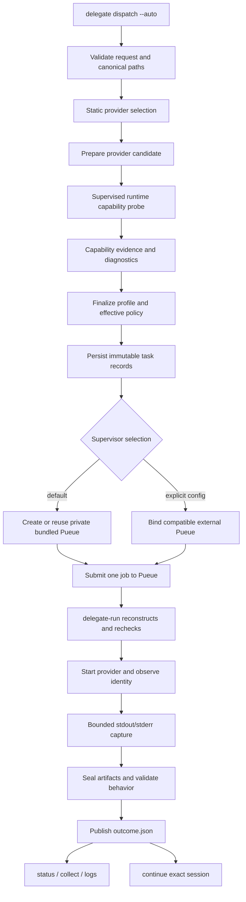

# Architecture

Delegation Layer separates request durability, supervisor control, provider
behavior, and result publication. A provider adapter describes a launch; the
shared core owns when a process may start and what evidence can become a
result.

The maintained Archify views are [system components](../diagrams/components.html)
and [one task lifecycle](../diagrams/lead-interface.html). Their editable
sources are [components.architecture.json](../diagrams/components.architecture.json)
and [lead-interface.sequence.json](../diagrams/lead-interface.sequence.json).

## Ownership boundaries

The CLI validates user input, resolves the catalog entry, and persists the
request. Provider preparation constructs an immutable candidate containing the
command, environment, policy, input/output declarations, and identity
observer. It does not start a process.

The inspection worker performs the provider's version and help checks under a
bounded timeout. Its non-secret facts are passed to the profile finalizer,
which records the observed version, executable identity, effective policy, and
bounded launch environment in the task metadata. The inspection binding keeps
the same environment for a queued worker, including when a private daemon is
reused for another task. The version is an observation; advertised behavior
and the executable identity decide compatibility. New profiles record native
permission selections without inventorying provider configuration. MCP servers,
hooks, plugins, skills, and authentication are owned by the provider CLI.
Workspace-write asks for unattended native tool execution; it does not add a
provider-independent sandbox. Historical tasks retain their recorded preparation
contract. New continuation tasks inherit the requested permission mode and use
the current native mapping without modifying predecessor evidence.

Pueue owns queueing and process supervision. A normal release carries the
`pueue` and `pueued` executables and creates a private state-rooted
configuration on demand. Commands that need supervisor control recover that
private daemon from the saved binding after a restart. An explicit
`--pueue-config` can bind an existing compatible supervisor. `delegate-run`
receives only the saved root and task ID,
reconstructs the recorded profile, and refuses to start
if the fresh profile no longer matches admission. The runner observes provider
identity, captures bounded streams, verifies declared artifacts, and seals the
evidence.

The task store and predicate registry own publication. A committed
`outcome.json` is the terminal authority; `result.txt` and sealed raw streams
are payload evidence referenced by validated descriptors. Collection can replay
that publication without requiring the provider or supervisor to remain
available.

## One turn and continuation

Each task has one immutable request and at most one provider launch attempt. A
continuation is a separate task that points to one exact predecessor. The
provider conversation reservation remains held until the predecessor has a
validated terminal outcome or a durable supervisor-ended budget-stop
observation, then the layer releases ownership for the successor. A budget-stop
observation permits session handoff only; it does not publish task completion.
This makes retries and recovery explicit rather than implicit replays.

The public `continue` command is a thin path over that existing continuation
boundary. It reuses the validated predecessor brief unless a follow-up brief is
supplied, preserves the provider session identity, and creates a new task
record. A timeout response advertises this path only after durable budget-stop
termination evidence is present.

## Runtime discovery

Provider registration is static and cheap. Host compatibility is dynamic: the
adapter locates its executable, checks that it is executable, runs version and
help, and verifies the flags it will use. This accommodates provider releases
that change their version number while preserving the command capabilities the
adapter depends on.

The implemented `delegate models` command is a separate advisory path. It
reuses the state-rooted supervisor and runs one bounded native model inspection
with the `model-discovery-v1` five-minute window, allowing first-run provider
model/cache initialization and recording sanitized model facts
without admitting a
provider task. Its `complete` flag describes model enumeration; null effort
metadata remains distinguishable from an explicitly empty list. Discovery is
never used as an admission allowlist, and model facts are not treated as proof
that an account can execute a listed model.

## Failure and recovery

Admission, liveness, and publication are recorded separately. A queue result,
process exit, or stop acknowledgment alone cannot create a successful outcome.
If a boundary is uncertain, later observation reconciles the saved evidence and
preserves the terminal winner. Explicit cancellation records a request and
observes its effect; it never authorizes an unverified retry.

Live provider acceptance is a separate verification gate. It requires the
provider executable, supervisor, and native authentication to be available. A
terminal authentication refusal produces a sanitized `BLOCKED` receipt with
exit status `2`; it is neutral in the aggregate live gate, while behavior or
evidence failures remain failures.
