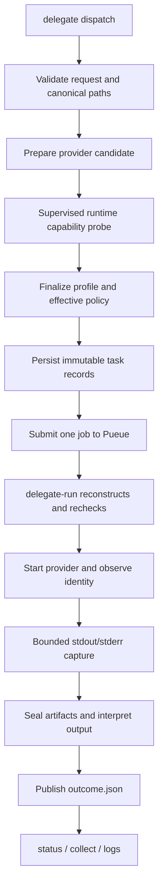

# Architecture

Delegation Layer separates request durability, supervisor control, provider
behavior, and result publication. A provider adapter describes a launch; the
shared core owns when a process may start and what evidence can become a
result.

The maintained Archify views are [system components](../diagrams/components.html)
and [one task lifecycle](../diagrams/lead-interface.html). Their editable
sources are [components.architecture.json](../diagrams/components.architecture.json)
and [lead-interface.sequence.json](../diagrams/lead-interface.sequence.json).

## Ownership boundaries

The CLI validates user input, resolves the catalog entry, and persists the
request. Provider preparation constructs an immutable candidate containing the
command, environment, policy, input/output declarations, and identity
observer. It does not start a process.

The inspection worker performs the provider's version and help checks under a
bounded timeout. Its non-secret facts are passed to the profile finalizer,
which records the observed executable identity and effective policy in the
task metadata.

Pueue owns queueing and process supervision. `delegate-run` receives only the
saved root and task ID, reconstructs the recorded profile, and refuses to start
if the fresh profile no longer matches admission. The runner observes provider
identity, captures bounded streams, verifies declared artifacts, and seals the
evidence.

The task store and predicate registry own publication. A committed
`outcome.json` is the terminal authority; `result.txt` and sealed raw streams
are payload evidence referenced by validated descriptors. Collection can replay
that publication without requiring the provider or supervisor to remain
available.

## One turn and continuation

Each task has one immutable request and at most one provider launch attempt. A
continuation is a separate task that points to one exact predecessor. The
provider conversation reservation remains held until the predecessor has a
validated terminal outcome and its runner releases ownership. This makes
retries and recovery explicit rather than implicit replays.

## Runtime discovery

Provider registration is static and cheap. Host compatibility is dynamic: the
adapter locates its executable, checks that it is executable, runs version and
help, and verifies the flags it will use. This accommodates provider releases
that change their version number while preserving the command capabilities the
adapter depends on.

## Failure and recovery

Admission, liveness, and publication are recorded separately. A queue result,
process exit, or stop acknowledgment alone cannot create a successful outcome.
If a boundary is uncertain, later observation reconciles the saved evidence and
preserves the terminal winner. Explicit cancellation records a request and
observes its effect; it never authorizes an unverified retry.
